# Find the Best Karak: GitHub Copilot Tutorial

## Introduction

 In this tutorial, we will guide you step-by-step to create an online treasure hunt game called Find the Best Karak. You'll learn how to leverage GitHub Copilot to develop this game using HTML and JavaScript. By the end of this tutorial, you’ll be able to create a fun, engaging treasure hunt game that runs on your local PC.

## Prerequisites

* Basic knowledge of HTML and JavaScript

* GitHub account with access to GitHub Copilot.

* Visual Studio Code

## Setup

1. Fork the repository on GitHub to store your project files.

    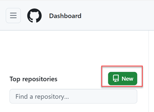

2. Give a repository name and description.

    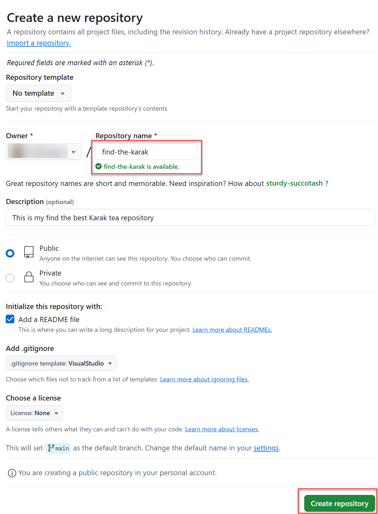

3. Copy the repository URL.

    

4. Clone the repository to your local machine using VSCode.

    

5. Open the project in your code editor.

    

## Development

### Task 1: Open GitHub Copilot Chat

1. Open the Copilot Edits view from the Command Center Copilot menu or press ```Ctrl+Shift+I```

    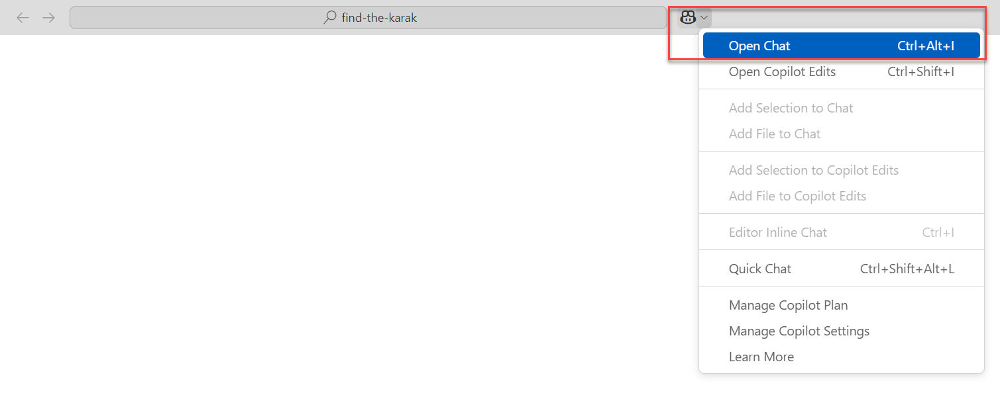

2. Then drag and drop the clues.json file from Explorer tab to "Working Set" field on the Copilot panel.

    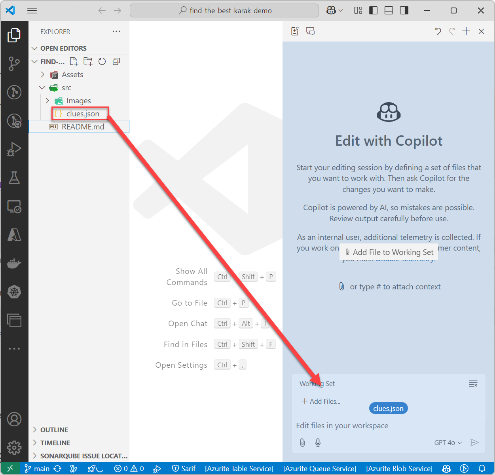

> [!TIP]
> Use Copilot Edits to start an AI-powered code editing session and iterate quickly on code changes across multiple files by using natural language. Copilot Edits applies the edits directly in the editor, where you can review them in-place, with the full context of the surrounding code.

### Task 2: Ask GitHub Copilot to Create your workspace with neccessary files

1. Use your creativity to ask Copilot to create the necessary files for your project.

   <details>
        <summary>Here is a good prompt that you can use.</summary>

         I'm creating a simple online treasure hunt game called "Find the Best Karak" using HTML and JavaScript. 
         The game will provide clues based on touristic places in Qatar, and the player will enter the name of the location to proceed. You can find the clues and answers in clues.json.
         Please help me generate the basic HTML, JavaScript and CSS files needed for this game in the src folder.
         The HTML file will include a heading, a paragraph to display clues, an input field for the player to enter the location, and a submit button.
       The JavaScript file will contain the logic for fetching the clues from the clues.json and present it on the html.

   </details>

2.If everything goes well, GitHub Copilot will generate the necessary files in the "src" folder. Review the generated files and "Accept" the changes if they meet your requirements. If the generated content is not satisfactory, press "Discard" and refine your prompt to improve the results.

   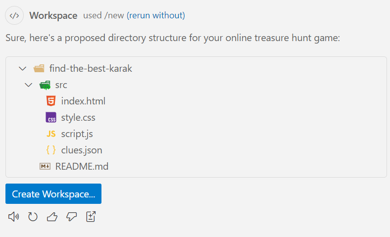

### Task 3: Test the Game

1. Open new terminal in VSCode from the Terminal menu on the top or press ```Ctrl+Shift+` ```.

    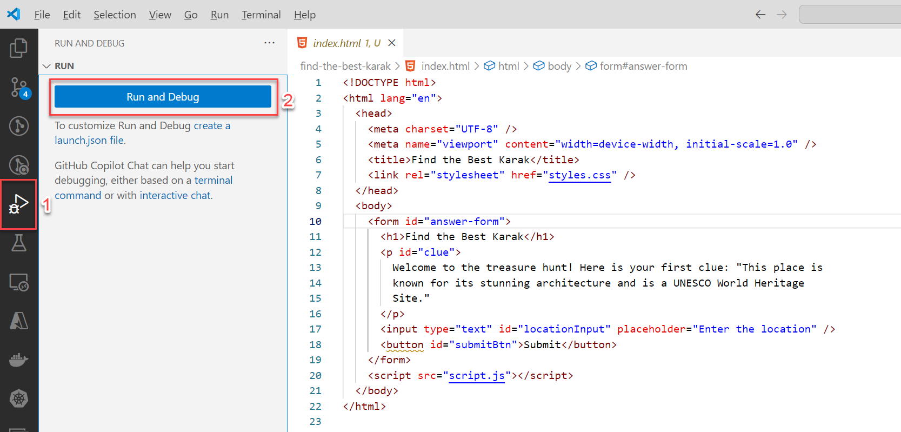

2. Then type ```http-server .```  to run the game in the browser.

   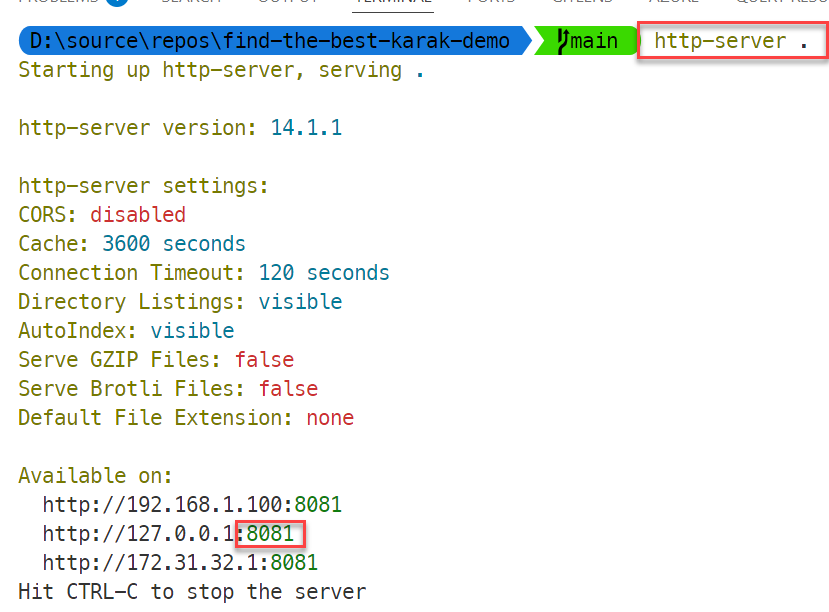

> [!TIP]
> http-server is a simple, zero-configuration command-line static HTTP server. It is powerful enough for production usage, but it's simple and hackable enough to be used for testing, local development and learning.

3. Open your web browser and navigate to `http://localhost:{port_number}/src/`. For example, if your port number is 8082, you would go to `http://localhost:8082/src/`.

   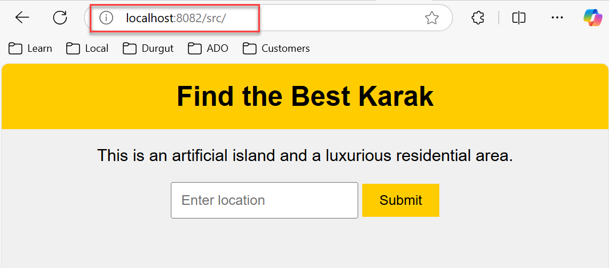

> [!IMPORTANT]  
> You may need to update the `script.js` or `index.html` files to resolve any issues or to enhance the game's functionality.

### Task 4: Show the Best Karak locations on Map

1. Return to Visual Studio Code and inspect the "Working Set" panel. You should see all the newly created files alongside `clues.json`. If they are not visible, drag and drop them from the Explorer window again.

   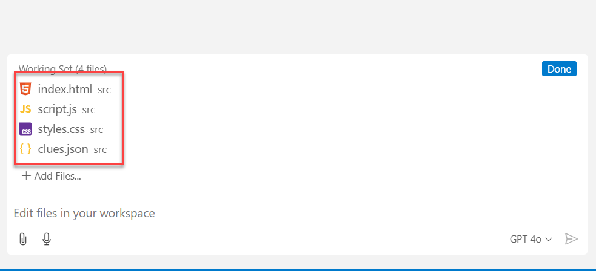

2. Ask Copilot to add Google map into your application.

   <details>
      <summary> Here is a good prompt that you can use </summary>
      I want to add google map on my page. Whenever a user finds the right answer I want to show the location of the place on the map. you can find the latitude and longtime of the locations in clues.json. Please help me to add the google map to the page and show the location of the places on the map.
   </details>
&nbsp;

3. GitHub Copilot will generate the necessary modifications to your project files and prompt you to update the API Key in the HTML file. Review and accept the changes, then replace the placeholder API Key with your own.

   

> [!IMPORTANT]  
> Ask proctors to give you the Google Map API Key.

4. Run and test the application again. When the player enters the correct location, the game should display the location on the map. At the end of the game, all the locations should be visible on the map. If application is not working as expected, review the code and make necessary changes with the help of Copilot.

   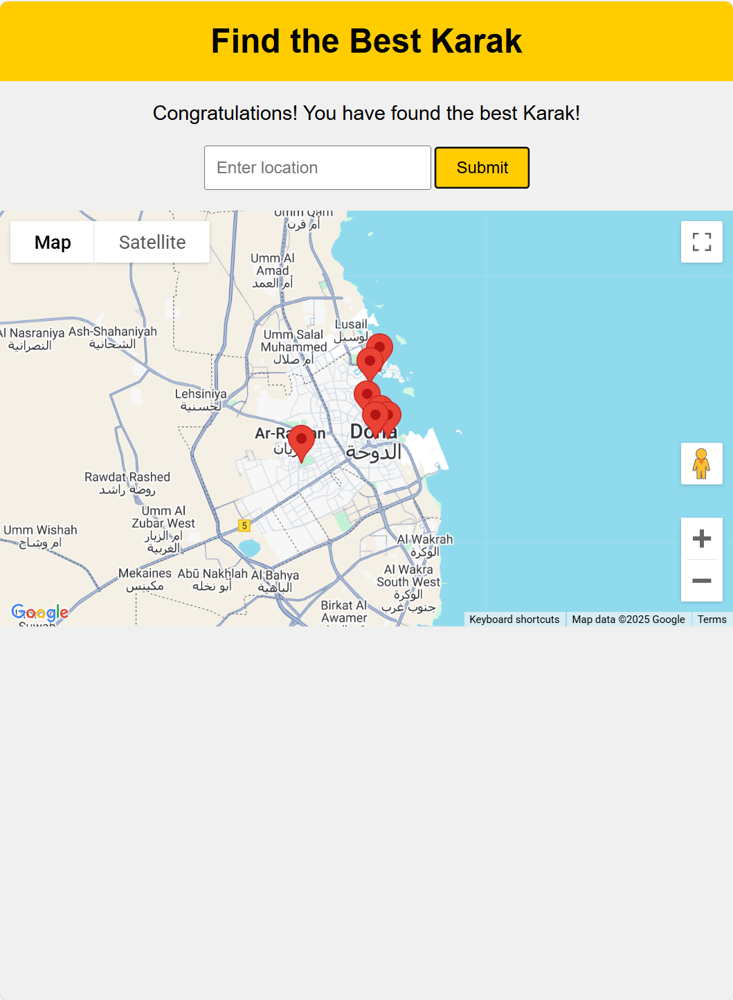

### Task 5: Show the Images of places in a Gallery View

1. Ask Copilot to add a gallery view to display images of the locations.

   <details>
      <summary> Here is a good prompt that you can use </summary>
      I want to add a gallery view to my page. Whenever a user finds the right answer I want to show the image of the place in the gallery. you can find the image URLs of the locations in clues.json. Please help me to add the gallery view to the page and show the images of the places in the gallery.
   </details>

2. GitHub Copilot will generate the necessary modifications to your project files. Review and accept the changes.
3. Test the application again. When the player enters the correct location, the game should display the image of the location in the gallery view. At the end of the game, all the images should be visible in the gallery. If application is not working as expected, review the code and make necessary changes with the help of Copilot.

   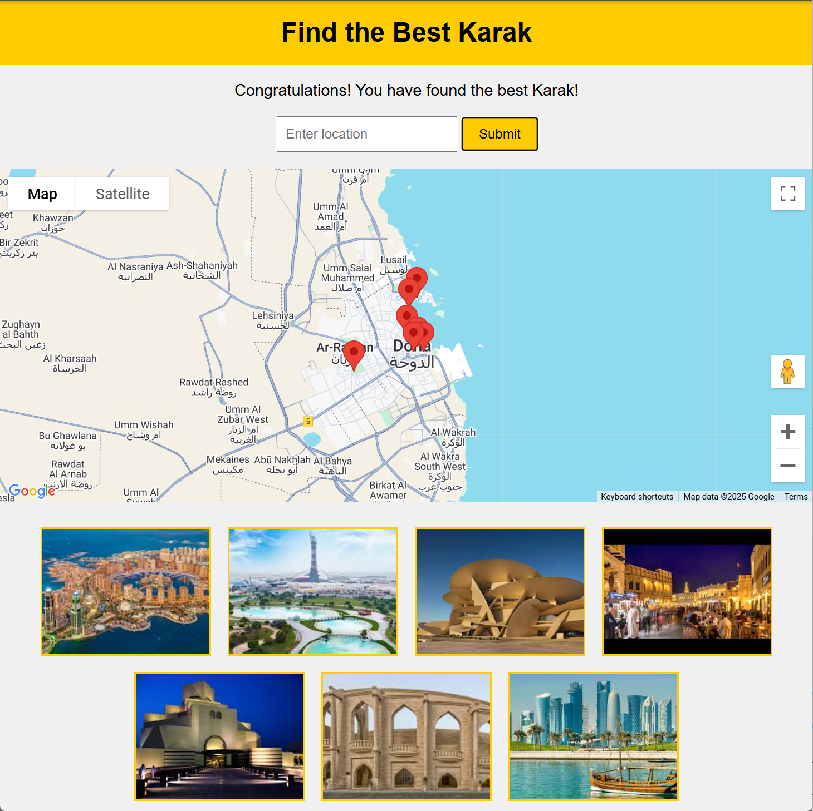

### Task 6: Improve the application with additional features

### Task 6: Enhance the Application with Additional Features

1. We have incorporated the location name and a 5-star rating system for each location in the final solution. Now, it's your opportunity to showcase your creativity by adding extra features to your application. Consider the following enhancements:

   * Add a timer to challenge players to complete the game within a certain timeframe.
   * Enhance the user interface with animations and transitions for a more engaging experience.
   * Include sound effects and background music to make the game more immersive.

2. Use GitHub Copilot to assist you in implementing these features. Review and test the changes thoroughly to ensure they meet your requirements.

   

### Task 7: Commit and Push Changes

1. Once you are satisfied with the changes, save the files and end your GitHub Copilot edit session by clicking the "Done" button. Commit the changes to your local repository by clicking the source control button on the left panel of VSCode and entering a commit message.

   

2. You can also use GitHub Copilot to generate a commit message with small magic button in the message box.

   

3. Sync the changes to your GitHub repository

   

### Task 6: Share your Project

1. Share the link to your GitHub repository with friends and family to showcase your treasure hunt game

   > [!TIP]
   > Check out my online treasure hunt game "Find the Best Karak" on GitHub: [Repository Link]

## Congratulations


