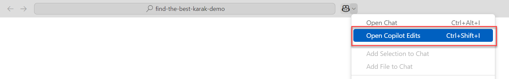

# Find the Best Karak: GitHub Copilot Tutorial

## Introduction

 In this tutorial, we will guide you step-by-step to create an online treasure hunt game called Find the Best Karak. You'll learn how to leverage GitHub Copilot to develop this game using HTML and JavaScript. By the end of this tutorial, you’ll be able to create a fun, engaging treasure hunt game that runs on your local PC.

## Prerequisites

* Basic knowledge of HTML and JavaScript

* GitHub account with access to GitHub Copilot.

* Visual Studio Code

## Setup

1. Fork the repository on GitHub to store your project files.

    

2. Give a repository name and description.

    

3. Copy the repository URL.

    

4. Clone the repository to your local machine using VSCode.

    

5. Open the project in your code editor.

    

## Development

### Task 1: Open GitHub Copilot Chat

 1. Open the Copilot Edits view from the Command Center Copilot menu or press ```Ctrl+Shift+I```

    

    Then drag and drop the clues.json file from Explorer tab to "Working Set" field on the Copilot panel.

    

> [!TIP]
> Use Copilot Edits to start an AI-powered code editing session and iterate quickly on code changes across multiple files by using natural language. Copilot Edits applies the edits directly in the editor, where you can review them in-place, with the full context of the surrounding code.

### Task 2: Ask GitHub Copilot to Create your workspace with neccessary files

 1. Use your creativity to ask Copilot to create the necessary files for your project.

    <details>
        <summary>Here is a good prompt that you can use.</summary>

       I'm creating a simple online treasure hunt game called "Find the Best Karak" using HTML and JavaScript. 
       The game will provide clues based on touristic places in Qatar, and the player will enter the name of the location to proceed. You can find the clues and answers in clues.json.
       Please help me generate the basic HTML, JavaScript and CSS files needed for this game in the src folder.
       The HTML file will include a heading, a paragraph to display clues, an input field for the player to enter the location, and a submit button.
       The JavaScript file will contain the logic for fetching the clues from the clues.json and present it on the html.

   </details>

2. If everything goes well, GitHub Copilot will generate the necessary files in the "src" folder. Review the generated files and "Accept" the changes if they meet your requirements. If the generated content is not satisfactory, press "Discard" and refine your prompt to improve the results.

   

### Task 3: Test the Game

 1. Open new terminal in VSCode from the Terminal menu on the top or press ```Ctrl+Shift+` ```

    

 2.Then type ```http-server {FOLDER NAME}```  to run the game in the browser.
   

> [!TIP]
> http-server is a simple, zero-configuration command-line static HTTP server. It is powerful enough for production usage, but it's simple and hackable enough to be used for testing, local development and learning.

 3.Open the browser and navigate to the "http://localhost:{port number}/src/". In my case it's 8082

    

> [!IMPORTANT]  
> You might need to update the `script.js` or `index.html` file to fix any issues or add more functionality to the game

### Task 4: Customize the Game

 1. Modify the game logic in the `script.js` file to add more clues and locations

    ```javascript
    // Add more locations and clues
    const locations = {
        "Doha Corniche": "A beautiful waterfront promenade in the heart of Doha.",
        "Souq Waqif": "A traditional market with cafes, restaurants, and shops.",
        "The Pearl-Qatar": "An artificial island with luxury residences and shopping.",
        "Katara Cultural Village": "A cultural hub with theaters, galleries, and restaurants.",
    };
    ```

 2. Use GitHub Copilot to beutify the game interface in the `index.html` file.
      <details>
         <summary> Here is a good prompt that you can use </summary>

          I am looking for a bootstrap template for a website.  It should be a minimal and dark toned template. Can you find me one and share the link?
      </details>

      If everything goes well, Copilot will find you a bootstrap template for you to use in your project.
         

### Task 5: Commit and Push Changes

   1. Once you are satisfied with the changes, save the files and commit them to your local repository. Click the source control button on the left panel of VSCode and enter a commit message.

      

   2. You can also use GitHub Copilot to generate a commit message with small magic button in the message box.

      

   3. Sync the changes to your GitHub repository

      

### Task 6: Share your Project

 1. Share the link to your GitHub repository with friends and family to showcase your treasure hunt game

   > [!TIP]
   > Check out my online treasure hunt game "Find the Best Karak" on GitHub: [Repository Link]

## Congratulations!
